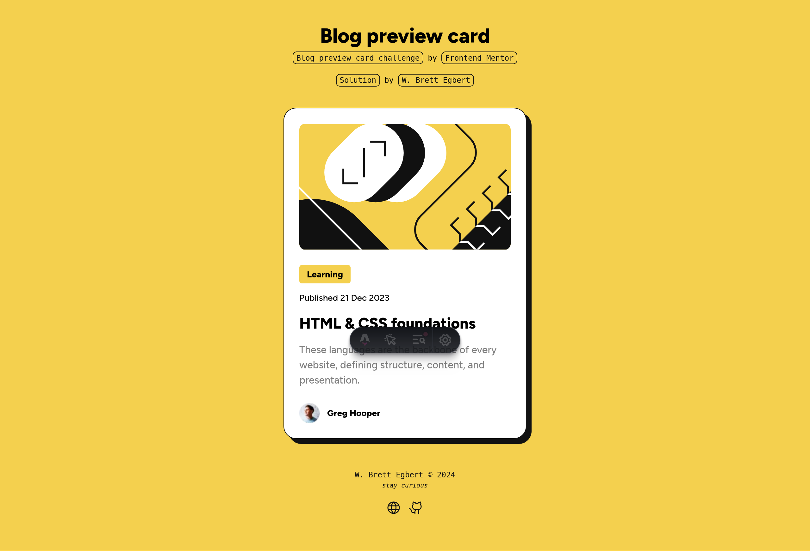

# Frontend Mentor - Blog preview card solution

This is a solution to the [Blog preview card challenge on Frontend Mentor](https://www.frontendmentor.io/challenges/blog-preview-card-ckPaj01IcS). Frontend Mentor challenges help you improve your coding skills by building realistic projects. 

## Table of contents

- [Frontend Mentor - Blog preview card solution](#frontend-mentor---blog-preview-card-solution)
  - [Table of contents](#table-of-contents)
  - [Overview](#overview)
    - [Screenshot](#screenshot)
    - [Links](#links)
  - [My process](#my-process)
    - [Built with](#built-with)
    - [What I learned](#what-i-learned)
    - [Continued development](#continued-development)
    - [Useful resources](#useful-resources)
  - [Author](#author)

## Overview

### Screenshot



### Links

- Solution URL: [github.com/crossinguard/fm-blog-preview-card](https://github.com/crossinguard/fm-blog-preview-card)
- Live Site URL: [cg-fm-blog-preview-card.netlify.app](https://cg-fm-blog-preview-card.netlify.app/)

## My process

### Built with

- [Astro](https://astro.build/) - web framework
  - starting point: blank template

- HTML, CSS, TypeScript - coding languages
- [GitHub](https://github.com/) - git repository host
- [Netlify](https://www.netlify.com/) - web host platform

### What I learned

As with my solution to the QR code component challenge, I wished to turn my solution into a reusable Astro component that could be easily customized for content and basic styles. I first created my targeted solution with all information hard coded in, including colors, names, image paths, etc. Once the desktop, mobile, and hover features looked as desired, I began work on turning my fixed component into one that accepted properties (props) to allow this component to be reused and altered on the fly.

```html
<div class="card">
  <Image src={blogImg} alt="" height="200" class="blog-image" />
  <div class="info">
    <p class="category font-small bold">Learning</p>
    <p class="pubdate font-small">Published 21 Dec 2023</p>
    <h2 class="title font-large bold">HTML &amp; CSS foundations</h2>
    <p class="description font-medium">
      These languages are the backbone of every website, defining structure,
      content, and presentation.
    </p>
  </div>
  <div class="author">
    <Image src={authorImg} alt="" height="32" />
    <p class="author-name font-small bold">Greg Hooper</p>
  </div>
</div>
```

My fixed component used standard HTML, CSS, and a few custom utility functions to help control fluid typography (see sources). This is easy to update but if I made changes to one card I would have to restructure all of them. To address this, I added custom properties to feed desired information into my card component.

```html
<div class="card">
  <Image src={images[feature_image]()} alt="" height="200" class="blog-image" />
  <div class="info">
    <p class="category font-small bold">{category_text}</p>
    <p class="pubdate font-small">{pubdate_text}</p>
    <h2 class="title font-large bold">{title_text}</h2>
    <p class="description font-medium">
      {description_text}
    </p>
  </div>
  <div class="author">
    <Image
      src={images[author_image]()}
      alt=`${author_name} profile`
      height="32"
    />
    <p class="author-name font-small bold">{author_name}</p>
  </div>
</div>
```

Type safety was ensured using TypeScript on each property within the component frontmatter/script. 

```typescript
import type { ImageMetadata } from 'astro';
import { Image } from 'astro:assets';

interface Props {
  accent_color: string;
  feature_image: string;
  category_text: string;
  pubdate_text: string;
  title_text: string;
  description_text: string;
  author_image: string;
  author_name: string;
}

const {
  accent_color,
  feature_image,
  category_text,
  pubdate_text,
  title_text,
  description_text,
  author_image,
  author_name,
} = Astro.props;

const images = import.meta.glob<{ default: ImageMetadata }>(
  '/src/assets/*.{jpeg,jpg,png,gif,svg,webp}'
);
if (!images[feature_image])
  throw new Error(
    `Feature image "${feature_image}" does not exist in glob: "src/assets/*.{jpeg,jpg,png,gif,svg,webp}"`
  );
if (!images[author_image])
  throw new Error(
    `Author image "${author_image}" does not exist in glob: "src/assets/*{jpeg,jpg,png,gif,svg,webp}"`
  );
```

Astro is a static site generator so dynamically calling images into the existing `<Image>` component required use of Vite’s `import.meta.glob` (per the [Astro docs](https://docs.astro.build/en/recipes/dynamically-importing-images/)). This allows me to limit which types of images can be used within the component in addition to ensuring all entered text is treated as a string.

To put this together and use my component with the desired text, I call my component and pass information into each of my defined properties.

```html
<Card
  accent_color="var(--yellow)"
  feature_image="/src/assets/illustration-article.svg"
  category_text="Learning"
  pubdate_text="Published 21 Dec 2023"
  title_text="HTML & CSS foundations"
  description_text="These languages are the backbone of every website, defining structure, content, and presentation."
  author_image="/src/assets/image-avatar.webp"
  author_name="Greg Hooper"
/>
```

Multiple cards could now be placed into a grid, each with separate information.

### Continued development

For creating multiple cards, I would look at implementing a card-data.json file with all information for the cards to be used. I generated an example using AI for illustration.

```json
[
  {
    "accent_color": "var(--yellow)",
    "feature_image": "/src/assets/illustration-article.svg",
    "category_text": "Learning",
    "pubdate_text": "Published 21 Dec 2023",
    "title_text": "HTML & CSS foundations",
    "description_text": "These languages are the backbone of every website, defining structure, content, and presentation.",
    "author_image": "/src/assets/image-avatar.webp",
    "author_name": "Greg Hooper"
  },
  {
    "accent_color": "var(--blue)",
    "feature_image": "/src/assets/illustration-article2.svg",
    "category_text": "Programming",
    "pubdate_text": "Published 15 Jan 2024",
    "title_text": "JavaScript Basics",
    "description_text": "Learn the fundamentals of JavaScript programming language.",
    "author_image": "/src/assets/image-avatar2.webp",
    "author_name": "Emily Smith"
  },
  {
    "accent_color": "var(--green)",
    "feature_image": "/src/assets/illustration-article3.svg",
    "category_text": "Technology",
    "pubdate_text": "Published 10 Feb 2024",
    "title_text": "Introduction to Artificial Intelligence",
    "description_text": "Explore the basics of AI and its applications.",
    "author_image": "/src/assets/image-avatar3.webp",
    "author_name": "David Johnson"
  },
  {
    "accent_color": "var(--red)",
    "feature_image": "/src/assets/illustration-article4.svg",
    "category_text": "Science",
    "pubdate_text": "Published 5 Mar 2024",
    "title_text": "The Universe and Beyond",
    "description_text": "Discover the mysteries of the universe and latest findings in astrophysics.",
    "author_image": "/src/assets/image-avatar4.webp",
    "author_name": "Sarah Lee"
  }
]
```

Using mapping, each entry’s information could be used to generated blog cards, automatically updating the number of cards as information is added or removed.

### Useful resources

- [Dynamically import images | Astro docs](https://docs.astro.build/en/recipes/dynamically-importing-images/) - For creating an Astro component that accepts an image path as a prop
- [Fluid Typography Calculator](https://royalfig.github.io/fluid-typography-calculator/) - For ensuring all text is fluid using `clamp()`, avoiding the use of media queries

## Author

- Website - [W. Brett Egbert | crossinguard.dev](https://crossinguard.dev/)
- Frontend Mentor - [@crossinguard](https://www.frontendmentor.io/profile/crossinguard)
